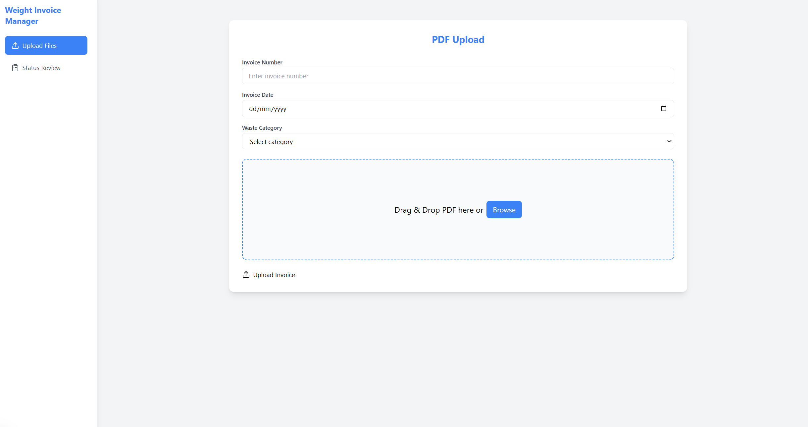

# Custom Enterprise Application with CRUD, IoT, VLM+RAG functionality

## Summary

This is a multi-service enterprise application with three main components:
- **Files API**: Document processing with VLM (Vision Language Model) and RAG capabilities
- **IoT Management**: Gateway and device management with event sourcing
- **Frontend Clients**: React/Next.js applications for user interfaces

## Architecture

### Component-Based Architecture

The application is organized into three distinct components for clean separation of concerns:

```
src/
├── files_api/          # 🚀 API Component (Lambda-Ready)
│   ├── routers/        # API endpoints
│   ├── services/       # Business logic
│   ├── adapters/       # Storage/Queue abstractions
│   └── config/         # Configuration management
│
├── vlm_workers/        # 🤖 Worker Component (Container-Ready)
│   ├── models/         # Model management
│   ├── processing/     # Processing utilities
│   └── scaling/        # Auto-scaling management
│
├── iot/                # 🌐 IoT Component
│   ├── db_layer/       # IoT services
│   ├── worker/         # IoT workers
│   └── gateway/        # Go-based gateway
│
└── deployment/         # 🏗️ Infrastructure Component (Deployment-Only)
    ├── aws/            # AWS deployment
    └── docker/         # Container definitions
```

### Current Overall Architecture


### Deployment of Colpali and SmolVLM for processing file uploads for specific data


## Tech Stack

- **Backend**: Python 3.7+, FastAPI, Pydantic
- **Frontend**: Next.js, React, TypeScript, Tailwind CSS
- **Database**: SQLite (local), MongoDB (NoSQL adapter), Event Store
- **ML/AI**: PyTorch, Transformers, Byaldi (ColPali), SmolVLM
- **Infrastructure**: AWS (Lambda, ECS, S3, SQS), Docker
- **IoT**: MQTT, Go-based gateway services

## How to Run

### Installation

```bash
# Install Python dependencies
make install
# or
pip install -e ".[dev]"

# Install frontend dependencies
make npm-install
```

### Deployment Modes

The application supports three deployment modes:

#### 1. Local Development (Recommended)
```bash
# Start both frontend and backend
make dev

# Or individually:
make local-dev  # Backend with mocked AWS
cd client && npm run dev  # Frontend
```

#### 2. AWS Mock (Docker Simulation)
```bash
# Test AWS deployment locally
make aws-mock

# Cleanup
make aws-mock-down
```

#### 3. AWS Production
```bash
# Deploy to real AWS
make aws-prod

# Cleanup
make aws-prod-cleanup
```

### Operational Commands

```bash
# Validation
make local-dev-validate    # Check local prerequisites
make aws-mock-validate     # Check Docker prerequisites  
make aws-prod-validate     # Check AWS prerequisites

# Monitoring
make aws-prod-status       # Check deployment status
make aws-prod-costs        # Analyze costs
make aws-prod-orphans      # Scan for orphaned resources

# Testing
make test                  # Run test suite
make test-quick           # Quick tests only
make lint                 # Code quality checks
```

## Preview

[Extract from digital copies](https://github.com/user-attachments/assets/b7423621-88a8-49a2-aac8-2d39b0a13d63)

[Extract handwritten notes on scanned copies](https://github.com/user-attachments/assets/da86c450-802b-470a-a7d9-2ff1e667bcd3)




[IoT Administrator Dashboard for managing gateways and End Devices](https://github.com/user-attachments/assets/ee58c146-f114-4bdc-8d97-9df7eb4414dd)

