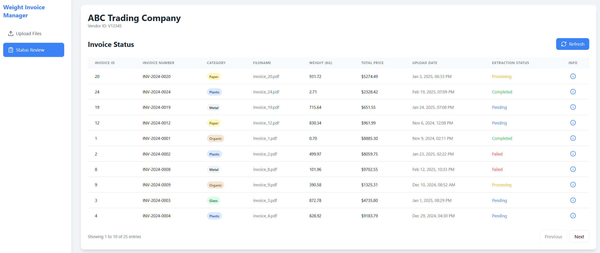

# Custom Enterprise Application with CRUD, IoT, VLM+RAG functionality

## Summary

This is a multi-service enterprise application with three main components:
- **Files API**: Document processing with VLM (Vision Language Model) and RAG capabilities
- **IoT Management**: Gateway and device management with event sourcing
- **Frontend Clients**: React/Next.js applications for user interfaces
- **Infrastructure/Deployment**: AWS-based deployment management for scalable application hosting

## Architecture

### Current Overall Architecture


### Component-Based Architecture

The application is organized into distinct components for clean separation of concerns:

```
src/
├── files_api/          # 🚀 API Component (Lambda-Ready)
│   ├── routers/        # API endpoints (files, invoices, health)
│   ├── services/       # Business logic and database services
│   ├── adapters/       # Storage and queue abstractions
│   ├── s3/             # S3 operations (read, write, delete, event notifications)
│   └── schemas.py      # Data models and validation
│
├── vlm_workers/        # 🤖 Worker Component (ECS-Ready)
│   ├── models/         # VLM model management and loaders
│   ├── processing/     # Invoice parsing and document processing
│   ├── gpu/            # GPU configuration for model inference
│   └── worker.py       # Main worker logic for processing tasks
│
├── iot/                # 🌐 IoT Component
│   ├── db_layer/       # IoT database services (gateway, device, measurement, config)
│   ├── worker/         # MQTT workers and state machines
│   ├── gateway/        # Go-based IoT gateway service
│   ├── rules_engine/   # Go-based rules processing engine
│   └── mosquitto/      # MQTT broker configuration
│
├── database/           # 💾 Shared Database Layer
│   ├── local.py        # Local SQLite database operations
│   ├── sqlite_http_adapter.py  # HTTP adapter for remote SQLite on EC2
│   ├── event_store.py  # Event sourcing implementation
│   └── indexes.py      # Database indexing utilities
│
└── deployment/         # 🏗️ Infrastructure Component
    ├── aws/            # AWS infrastructure (Lambda, ECS, EC2, API Gateway, etc.)
    ├── docker/         # Container definitions and compose files
    └── kubernetes/     # Kubernetes manifests
```

## Tech Stack

- **Backend**: Python 3.7+, FastAPI, Pydantic
- **Frontend**: Next.js, React, TypeScript, Tailwind CSS
- **Database**: SQLite (local and EC2), Event Store
- **ML/AI**: PyTorch, Transformers, Byaldi (ColPali), SmolVLM
- **Infrastructure**: AWS (Lambda, ECS, S3, SQS, EC2, ASG, API Gateway), Docker
- **IoT**: MQTT, Go-based gateway services

## How to Run

For detailed instructions on running the application, please refer to:
- **Files API**: See `src/files_api/README.md`
- **IoT Services**: See `src/iot/README.md`

## Latest Relevant Articles

<!-- Add links to relevant articles, blog posts, or documentation here -->

## Preview

[Extract from digital copies](https://github.com/user-attachments/assets/b7423621-88a8-49a2-aac8-2d39b0a13d63)

[Extract handwritten notes on scanned copies](https://github.com/user-attachments/assets/da86c450-802b-470a-a7d9-2ff1e667bcd3)




[IoT Administrator Dashboard for managing gateways and End Devices](https://github.com/user-attachments/assets/ee58c146-f114-4bdc-8d97-9df7eb4414dd)

