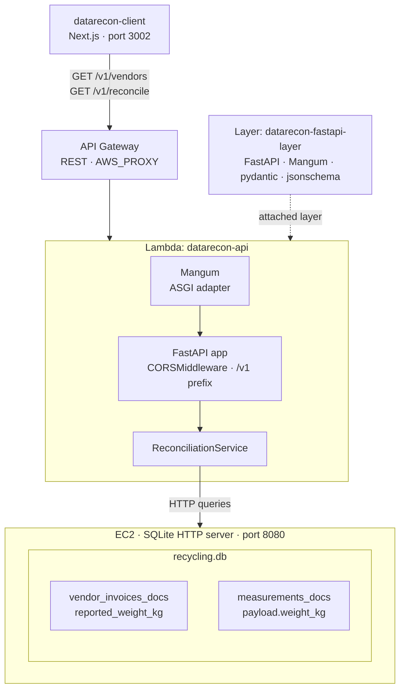
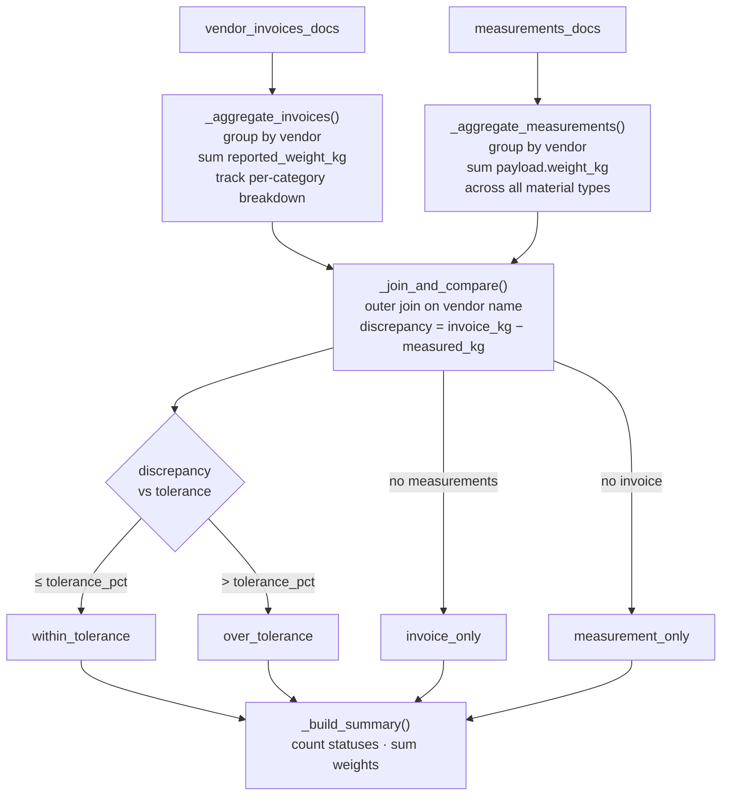

# Data Reconciliation API

Reconciles vendor invoice weights against accumulated IoT-measured weights. For a given billing period, it sums all invoice weights per vendor and compares them against the total weight recorded by IoT devices for that vendor — across all waste material types.

## Architecture

### Component overview



### Reconciliation flow



### Reconciliation logic

- **Grouping key**: vendor name only (not vendor + category).
- **Invoice side**: sums `reported_weight_kg` across all invoices for that vendor in the period. Tracks a per-category breakdown (`category_breakdown`) for the detail view.
- **Measurement side**: sums `payload.weight_kg` across all `weight_measurement` documents for that vendor in the period, regardless of `payload.material_category`.
- **Discrepancy**: `invoice_weight_kg − measured_weight_kg`. Status is `within_tolerance`, `over_tolerance`, `invoice_only`, or `measurement_only`.
- **Period validation**: only current month and up to 2 months back (`max_lookback_months`).

### Key files

| File | Purpose |
|------|---------|
| `main.py` | FastAPI app factory — CORSMiddleware, router, DB init |
| `routes.py` | `GET /v1/vendors`, `GET /v1/reconcile`, `GET /health` |
| `schemas.py` | Pydantic response models |
| `settings.py` | Config via env vars / `.env` files |
| `services/reconciliation.py` | Core reconciliation logic |
| `lambda_handler.py` | Mangum entry point for Lambda |

### Environment variables

| Variable | Local default | AWS value |
|----------|--------------|-----------|
| `DEPLOYMENT_MODE` | `local-dev` | `deploy-aws` |
| `DATABASE_HOST` | _(not needed locally)_ | EC2 public IP (e.g. `44.203.168.247`) |
| `DATABASE_PORT` | _(not needed locally)_ | `8080` |
| `DEFAULT_TOLERANCE_PCT` | `5.0` | `5.0` |
| `MAX_LOOKBACK_MONTHS` | `2` | `2` |

---

## Running locally

### Backend only

```bash
make datarecon-backend-start
```

Starts the FastAPI server at `http://localhost:8002` with `--reload`.
Interactive API docs at `http://localhost:8002/`.

### Backend + frontend together

```bash
make datarecon-dev
```

Starts both the FastAPI backend (port 8002) and the Next.js frontend (port 3002) in one command.

### Frontend only (if backend is already running)

```bash
cd datarecon-client
npm run dev        # port 3002
```

### Stop the backend

```bash
make datarecon-backend-cleanup
```

---

## Deploying to AWS

Requires an active AWS SSO session and `DATABASE_HOST` set in `.env.deploy-aws`.

```bash
aws sso login --profile aws-prod
export AWS_PROFILE=aws-prod
make deploy-datarecon-aws
```

This runs `deployment/aws/services/datarecon_deploy.py` which:

1. **Packages** `src/datarecon/` and `src/database/` into a ZIP
2. **Layer** — reuses `datarecon-fastapi-layer` if it exists; otherwise builds a new one using the `public.ecr.aws/lambda/python:3.11` Docker image and publishes it
3. **IAM role** — creates `datarecon-lambda-execution-role` if it does not exist
4. **Lambda** — creates or updates `datarecon-api` with the package, layer, and env vars

### After deploying: set DATABASE_HOST

If the EC2 database IP has changed (or after a fresh deploy that didn't pass `--database-host`), update the Lambda env var manually:

```bash
aws lambda update-function-configuration \
  --function-name datarecon-api \
  --region us-east-1 \
  --environment 'Variables={DEPLOYMENT_MODE=deploy-aws,DATABASE_HOST=<EC2_IP>,DATABASE_PORT=8080}'
```

The current EC2 IP can be read from any other Lambda that has `DATABASE_HOST` set:

```bash
aws lambda get-function-configuration \
  --function-name fastapi-app-files-api \
  --query 'Environment.Variables.DATABASE_HOST' --output text
```

### AWS resources created

| Resource | Name |
|----------|------|
| Lambda function | `datarecon-api` |
| Lambda layer | `datarecon-fastapi-layer` |
| IAM role | `datarecon-lambda-execution-role` |
| API Gateway | pre-existing (not managed by this script) |
