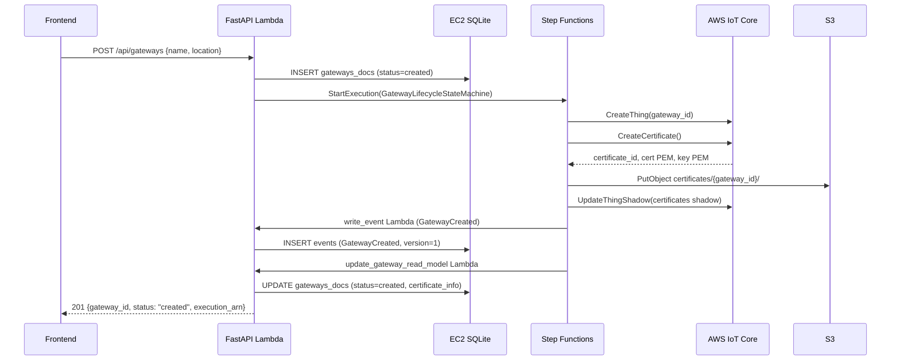
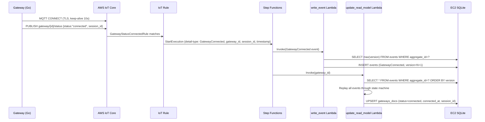
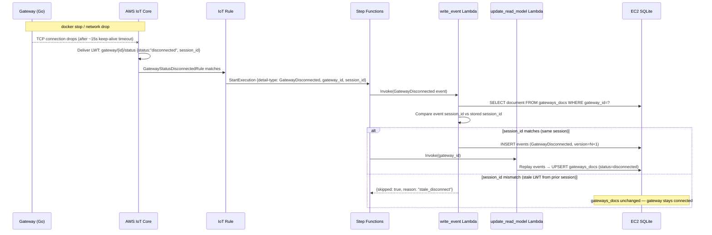
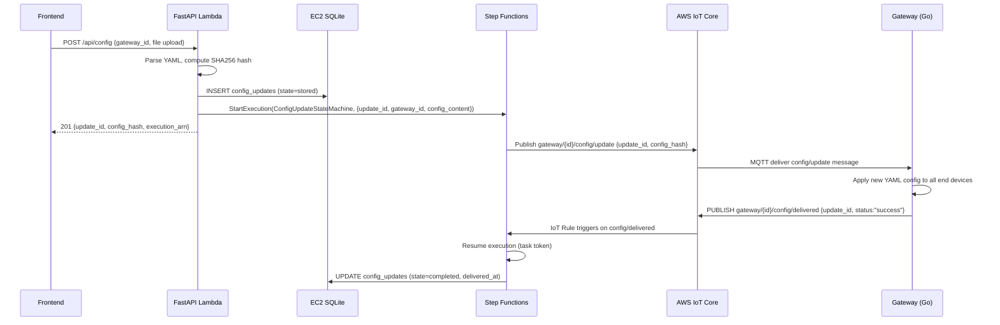
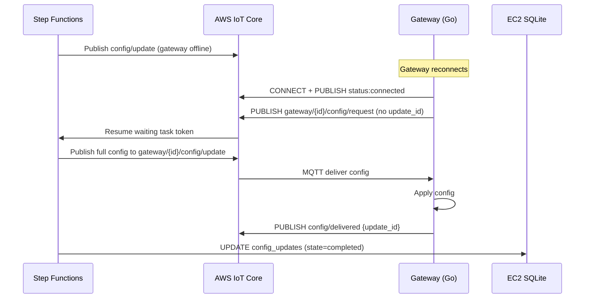
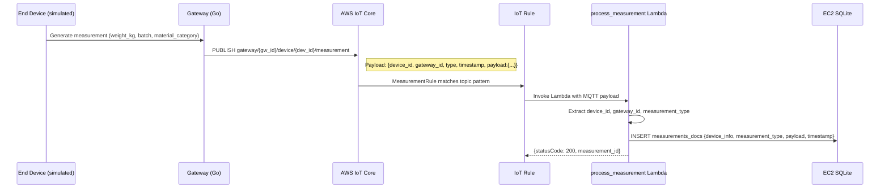

# IoT Gateway & Device Management — Architecture Guide

## Table of Contents

1. [System Overview](#system-overview)
2. [Directory Structure](#directory-structure)
3. [Architecture](#architecture)
   - [Local Mode](#local-mode)
   - [AWS Mode](#aws-mode)
4. [Event Sourcing & State Machines](#event-sourcing--state-machines)
5. [Sequence Diagrams](#sequence-diagrams)
   - [Gateway Creation](#gateway-creation)
   - [Gateway Connect / Disconnect](#gateway-connect--disconnect)
   - [Configuration Update Delivery](#configuration-update-delivery)
   - [Measurement Collection](#measurement-collection)
6. [AWS Lambda Functions](#aws-lambda-functions)
7. [API Endpoints](#api-endpoints)
8. [Deploy Locally](#deploy-locally)
9. [Deploy to AWS](#deploy-to-aws)
10. [Environment Variables](#environment-variables)

---

## System Overview

This system manages IoT gateways and their connected end-devices. It supports two deployment targets that share the same API surface:

| | **Local** | **AWS** |
|---|---|---|
| Worker | `LocalWorker` | `AWSWorker` (stateless Lambda) |
| Database | SQLite (file) | SQLite HTTP server on EC2 |
| MQTT broker | Mosquitto (Docker) | AWS IoT Core |
| State orchestration | In-process state machine | AWS Step Functions |
| Event store | Local SQLite | Lambda → EC2 SQLite via HTTP |
| Certificate mgmt | Manual / test certs | AWS IoT Core + S3 |

The core design uses **event sourcing**: every state change is an immutable event appended to an event store. Current state is always derived by replaying events in order.

---

## Directory Structure

```
src/iot/
├── main.py                        # FastAPI app factory with worker injection
├── routes.py                      # All API route handlers
├── schemas.py                     # Pydantic models
├── lambda_handler.py              # AWS Lambda entry point (Mangum wrapper)
│
├── worker/
│   ├── base.py                    # Abstract BaseWorker interface
│   ├── local_worker.py            # Full-featured local worker (Docker + MQTT)
│   ├── aws_worker.py              # Stateless Lambda worker (HTTP adapter only)
│   ├── mqtt_client.py             # MQTT wrapper with auto-reconnect
│   ├── state_machine.py           # GatewayStateMachine (event replay)
│   └── config_state_machine.py    # ConfigUpdateStateMachine
│
├── db_layer/
│   ├── gateway_service.py         # gateways_docs read/write
│   ├── config_service.py          # config_updates read/write
│   ├── device_service.py          # end device documents
│   └── measurement_service.py     # measurement documents
│
├── lambdas/
│   ├── write_event.py             # Append event to event store
│   ├── update_gateway_read_model.py  # Replay events → rebuild gateways_docs
│   ├── process_measurement.py     # Store measurement from IoT Rule
│   └── check_gateway_status.py    # Query IoT Thing shadow for status
│
├── gateway/
│   ├── main.go                    # Go gateway simulator
│   └── Dockerfile
│
├── rules_engine/
│   ├── main.go                    # Go MQTT rules router
│   └── config.yaml                # Topic → action rules
│
└── docker-compose.yml             # Local stack orchestration
```

---

## Architecture

### Local Mode

```
┌─────────────┐    HTTP     ┌──────────────────────────────────┐
│  Frontend   │────────────▶│  FastAPI (LocalWorker)           │
└─────────────┘             │  • Event store (SQLite)          │
                            │  • State machine (in-process)    │
                            │  • Docker orchestration          │
                            │  • Heartbeat checker (async)     │
                            └──────────────┬───────────────────┘
                                           │ subscribe / publish
                                     ┌─────▼──────┐
                                     │  Mosquitto │
                                     │  (MQTT)    │
                                     └─────┬──────┘
                         ┌─────────────────┼─────────────────┐
                   ┌─────▼──────┐   ┌──────▼──────┐   ┌──────▼──────┐
                   │  Gateway   │   │  Rules      │   │  Gateway   │
                   │ Simulator  │   │  Engine     │   │ Simulator  │
                   │ (Go)       │   │  (Go)       │   │ (Go)       │
                   └────────────┘   └─────────────┘   └────────────┘
                                          │ HTTP POST /api/mqtt/events
                                          └──────────────────────────▶ FastAPI
```

The **Rules Engine** subscribes to `gateway/#` and forwards MQTT messages to the FastAPI backend via HTTP, decoupling message routing from business logic.

### AWS Mode

```
┌─────────────┐    HTTPS    ┌────────────────────────────────────────┐
│  Frontend   │────────────▶│  API Gateway → Lambda (AWSWorker)      │
└─────────────┘             │  • HTTP adapter → EC2 SQLite server    │
                            │  • Starts Step Functions executions    │
                            └────────────────┬───────────────────────┘
                                             │
                              ┌──────────────▼──────────────────────┐
                              │         Step Functions              │
                              │  GatewayLifecycleStateMachine       │
                              │  ConfigUpdateStateMachine           │
                              └──────┬──────────────┬───────────────┘
                                     │              │
                          ┌──────────▼──┐    ┌──────▼──────────────┐
                          │ write_event │    │ update_gateway_     │
                          │  Lambda     │    │ read_model Lambda   │
                          └──────┬──────┘    └──────┬──────────────┘
                                 │                  │
                            ┌────▼──────────────────▼────┐
                            │  EC2: SQLite HTTP Server   │
                            │  • events table            │
                            │  • gateways_docs table     │
                            │  • config_updates table    │
                            └────────────────────────────┘

                   ┌──────────────────────────────────────────┐
                   │             AWS IoT Core                 │
                   │  • Thing registry + shadows              │
                   │  • Certificate management                │
                   │  • IoT Rules → Lambda triggers           │
                   └──────────────┬───────────────────────────┘
                                  │ MQTT (TLS, port 8883)
                          ┌───────▼────────┐
                          │ Gateway (Go)   │
                          │ on EC2/device  │
                          └────────────────┘
```

---

## Event Sourcing & State Machines

### Event Sourcing

All gateway and config state changes are recorded as **immutable events** in an `events` table:

```
events
├── aggregate_id    (gateway_id)
├── aggregate_type  ("gateway" | "config")
├── event_type      ("GatewayConnected", "ConfigDelivered", ...)
├── event_data      (JSON payload)
├── version         (monotonically increasing per aggregate)
└── timestamp       (UTC)
```

Current state is never stored directly — it is always **reconstructed by replaying all events** for that aggregate in version order. The reconstructed state is then cached in a **read model** (`gateways_docs`, `config_updates`) for fast API reads.

Benefits:
- Full audit trail of every state transition
- Read model can be rebuilt at any time by re-running the replay Lambda
- Stale events (e.g. late-arriving MQTT LWTs) can be detected and discarded by comparing timestamps

### Gateway State Machine

```
                    GatewayCreated
       ┌──────────────────────────────────┐
       │                                  ▼
  [start]                            CREATED
                                          │
                             GatewayConnected
                                          │
                                          ▼
                                     CONNECTED ◀──┐
                                          │       │ GatewayConnected
                          GatewayDisconnected     │ (reconnect)
                                          │       │
                                          ▼       │
                                    DISCONNECTED ─┘
                                          │
                              GatewayDeleted (or from CONNECTED)
                                          │
                                          ▼
                                      DELETED
```

Events and the timestamps they set:

| Event | Timestamp field set |
|---|---|
| `GatewayCreated` | `created_at` |
| `GatewayConnected` | `connected_at` |
| `GatewayDisconnected` | `disconnected_at` |
| `GatewayDeleted` | `deleted_at` |
| `GatewayUpdated` (heartbeat) | `last_heartbeat`, `last_updated` |

### Config Update State Machine

```
ConfigCreated
     │
     ▼
CONFIGURATION_STORED
     │
     │ ConfigPublished (MQTT notify)
     ▼
WAITING_FOR_REQUEST
     │
     │ ConfigRequested (gateway pulls)
     ▼
NOTIFYING_GATEWAY
     │
     │ ConfigSent
     ▼
WAITING_FOR_ACK
     │
     │ ConfigDelivered (gateway acks)
     ▼
UPDATE_COMPLETED
```

The state machine is **resilient to skipped transitions**: if the gateway delivers the config without sending an explicit request (e.g. after reconnect), the machine fills in implicit timestamps for the skipped states and accepts the delivery.

### Stale LWT Guard

When a gateway reconnects rapidly (e.g. container restart), the MQTT broker may deliver the old session's **Last Will & Testament** (LWT) *after* the new session's `connected` event has already been written. Without a guard, this would incorrectly flip the gateway to `disconnected`.

The `write_event` Lambda and `update_gateway_read_model` Lambda both implement this guard:

1. Each gateway process generates a unique `session_id = time.Now().UnixNano()` at startup
2. Both the `GatewayConnected` and LWT `GatewayDisconnected` messages carry this `session_id`
3. On receiving `GatewayDisconnected`, the Lambda compares the event's `session_id` with the `session_id` stored from the last `GatewayConnected` event
4. If they differ, the disconnect belongs to a prior session → **skip it**

---

## Sequence Diagrams

### Gateway Creation



### Gateway Connect / Disconnect

#### Connect (via MQTT)



#### Disconnect (via LWT on container stop)



### Configuration Update Delivery



#### Config Delivery with Gateway Reconnect



### Measurement Collection



---

## AWS Lambda Functions

| Function | Trigger | Responsibility |
|---|---|---|
| `fastapi-app-iot-backend` | API Gateway | Main API handler (Mangum wrapper around FastAPI) |
| `iot-write-event` | Step Functions | Append event to event store with version check + stale-LWT guard |
| `iot-update-gateway-read-model` | Step Functions | Replay all events → rebuild `gateways_docs` document |
| `iot-process-measurement` | IoT Rule | Store device measurement from MQTT into `measurements_docs` |
| `iot-check-gateway-status` | Step Functions | Poll IoT Thing shadow to confirm gateway status |
| `iot-provision-certificate` | Step Functions | Create IoT certificate, attach policy, store in S3 |
| `iot-update-shadow` | Step Functions | Write certificate info to IoT Thing shadow |
| `iot-store-task-token` | Step Functions | Store Step Functions task token for async callback |
| `iot-resume-config-request` | IoT Rule (config/request) | Resume Step Functions waiting for gateway config request |
| `iot-resume-config-ack` | IoT Rule (config/delivered) | Resume Step Functions waiting for gateway delivery ack |
| `iot-generate-presigned-url` | Step Functions | Generate S3 presigned URLs for certificate download |
| `iot-publish` | Step Functions | Publish MQTT message to IoT Core on behalf of Step Functions |
| `iot-handle-gateway-update` | Step Functions | Handle gateway metadata updates |

### IoT Rules

| Rule | Topic Pattern | Action |
|---|---|---|
| `GatewayStatusConnectedRule` | `gateway/+/status` WHERE `status = 'connected'` | Start `GatewayLifecycleStateMachine` execution |
| `GatewayStatusDisconnectedRule` | `gateway/+/status` WHERE `status = 'disconnected'` | Start `GatewayLifecycleStateMachine` execution |
| `MeasurementRule` | `gateway/+/device/+/measurement` | Invoke `iot-process-measurement` Lambda |
| `ConfigRequestRule` | `gateway/+/config/request` | Invoke `iot-resume-config-request` Lambda |
| `ConfigDeliveredRule` | `gateway/+/config/delivered` | Invoke `iot-resume-config-ack` Lambda |

---

## API Endpoints

### Gateway Management

| Method | Path | Description |
|---|---|---|
| `POST` | `/api/gateways` | Create gateway; starts `GatewayLifecycleStateMachine` in AWS mode |
| `GET` | `/api/gateways` | List all gateways |
| `GET` | `/api/gateways/{id}` | Get gateway status |
| `PUT` | `/api/gateways/{id}` | Update name / location |
| `DELETE` | `/api/gateways/{id}` | Delete gateway |
| `POST` | `/api/gateways/{id}/reset` | Disconnect then reconnect (local testing) |
| `GET` | `/api/gateways/{id}/certificates` | Get S3 presigned certificate URLs (AWS only) |

### Configuration

| Method | Path | Description |
|---|---|---|
| `POST` | `/api/config` | Upload config file; starts `ConfigUpdateStateMachine` in AWS mode |
| `GET` | `/api/config` | List config updates (filter by `gateway_id`) |
| `GET` | `/api/config/{update_id}` | Get specific update |
| `GET` | `/api/config/gateway/{id}/latest` | Get latest config for a gateway |

### MQTT Events (internal — called by Rules Engine in local mode)

| Method | Path | Description |
|---|---|---|
| `POST` | `/api/mqtt/events` | Process gateway MQTT event |
| `POST` | `/api/config/mqtt/events` | Process config-related MQTT event |

### Devices & Measurements

| Method | Path | Description |
|---|---|---|
| `GET` | `/api/devices` | List end devices (filter by `gateway_id`) |
| `POST` | `/api/measurements` | Store measurement (called by Lambda proxy) |
| `GET` | `/api/measurements` | List measurements |

---

## Deploy Locally

### Prerequisites

- Docker + Docker Compose
- Python 3.11+
- Go 1.21+ (to rebuild gateway image)

### Steps

```bash
# 1. Clone and enter the project
cd src/iot

# 2. Start the full local stack
#    Starts: Mosquitto, rules_engine, one gateway simulator
docker-compose up -d

# 3. Install Python dependencies
pip install -r requirements.txt

# 4. Run the FastAPI backend in local mode
DEPLOYMENT_MODE=local python -m iot.cli start --port 8000 --reload

# 5. Verify health
curl http://localhost:8000/health
```

### Creating a Gateway Locally

```bash
# Create gateway (LocalWorker starts a Docker container automatically)
curl -X POST http://localhost:8000/api/gateways \
  -H "Content-Type: application/json" \
  -d '{"name": "Lab Gateway", "location": "Server Room A"}'

# Response includes gateway_id
# Watch docker ps — a new gateway container will appear

# Check status
curl http://localhost:8000/api/gateways/lab-gateway
```

### Uploading a Config Locally

```bash
# Create a YAML config file
cat > /tmp/test-config.yaml <<EOF
version: "1.0"
devices:
  - suffix: "-1"
    parameter_set: batch
  - suffix: "-2"
    parameter_set: batch
EOF

# Upload
curl -X POST http://localhost:8000/api/config \
  -F "gateway_id=lab-gateway" \
  -F "file=@/tmp/test-config.yaml"
```

### Rebuilding the Gateway Docker Image

```bash
cd src/iot/gateway
docker build -t iot-gateway:latest .

# Then restart compose
docker-compose up -d --build gateway
```

---

## Deploy to AWS

### Infrastructure Overview

You need the following AWS resources (provisioned separately via CDK/Terraform or manually):

- **EC2 instance** — runs the SQLite HTTP server on port 8080 (use an Elastic IP to avoid IP changes on restart)
- **Lambda functions** — see table in [AWS Lambda Functions](#aws-lambda-functions)
- **Step Functions** — `GatewayLifecycleStateMachine`, `ConfigUpdateStateMachine`
- **AWS IoT Core** — Thing type, policies, IoT Rules
- **S3 bucket** — certificate storage (`iot-gateway-certificates`)
- **API Gateway** — HTTP API fronting the `fastapi-app-iot-backend` Lambda

### 1. Package and Deploy the Lambda

```bash
# From project root
cd src/iot

# Install dependencies into a package directory
pip install -r requirements.txt -t package/

# Copy source
cp -r iot/ package/

# Zip it up
cd package && zip -r ../lambda.zip . && cd ..

# Deploy (replace FUNCTION_NAME as needed)
AWS_PROFILE=aws-prod aws lambda update-function-code \
  --function-name fastapi-app-iot-backend \
  --zip-file fileb://lambda.zip

# Wait for update to complete
AWS_PROFILE=aws-prod aws lambda wait function-updated \
  --function-name fastapi-app-iot-backend
```

### 2. Set Lambda Environment Variables

```bash
AWS_PROFILE=aws-prod aws lambda update-function-configuration \
  --function-name fastapi-app-iot-backend \
  --environment '{"Variables":{
    "DEPLOYMENT_MODE": "deploy-aws",
    "DATABASE_HOST": "<EC2-PUBLIC-IP>",
    "DATABASE_PORT": "8080",
    "GATEWAY_SM_ARN": "arn:aws:states:us-east-1:<ACCOUNT>:stateMachine:GatewayLifecycleStateMachine",
    "CONFIG_SM_ARN":  "arn:aws:states:us-east-1:<ACCOUNT>:stateMachine:ConfigUpdateStateMachine"
  }}'
```

> **Note:** If your EC2 instance is restarted and gets a new public IP, update `DATABASE_HOST` here. Assign an **Elastic IP** to the EC2 instance to avoid this.

### 3. Update IoT Rules (if needed)

Both rules must include `session_id` in the SELECT clause and use `awsIotSqlVersion: "2016-03-23"`:

```bash
# Connected rule
AWS_PROFILE=aws-prod aws iot replace-topic-rule \
  --rule-name GatewayStatusConnectedRule \
  --topic-rule-payload file://deployment/connected-rule.json

# Disconnected rule
AWS_PROFILE=aws-prod aws iot replace-topic-rule \
  --rule-name GatewayStatusDisconnectedRule \
  --topic-rule-payload file://deployment/disconnected-rule.json
```

See `deployment/IOT_RULES_SQL_REFERENCE.md` for the full SQL and JSON payloads.

### 4. Register a Gateway and Install Certificates

```bash
# 1. Create gateway via API
curl -X POST https://<API_GW_URL>/dev/api/gateways \
  -H "Content-Type: application/json" \
  -d '{"name": "Prod Gateway 1", "location": "Warehouse A"}'

# 2. Wait for Step Functions to complete certificate provisioning
#    (check AWS Console → Step Functions → GatewayLifecycleStateMachine)

# 3. Download certificates via the UI "Download Certificates" button
#    or directly:
curl https://<API_GW_URL>/dev/api/gateways/<gateway_id>/certificates
# Returns presigned S3 URLs valid for 1 hour

# 4. Copy certificates onto the gateway device
#    Place cert.pem, key.pem, AmazonRootCA1.pem into /app/certificates/
#    The gateway Go process watches this directory and connects automatically
```

### 5. Run the Gateway on EC2 or a Device

```bash
# Build the gateway binary
cd src/iot/gateway
docker build -t iot-gateway:latest .

# Run with certificates mounted
docker run -d \
  --name iot-gateway-1 \
  -e GATEWAY_ID=prod-gateway-001 \
  -e MQTT_BROKER_ADDRESS=<IOT_CORE_ENDPOINT>:8883 \
  -e AWS_ENV=true \
  -v /path/to/certs:/app/certificates \
  iot-gateway:latest
```

---

## Environment Variables

### FastAPI Lambda / Local API

| Variable | Default | Description |
|---|---|---|
| `DEPLOYMENT_MODE` | `local` | `local` or `deploy-aws` |
| `DATABASE_HOST` | `localhost` | EC2 SQLite server IP (AWS mode) |
| `DATABASE_PORT` | `8080` | EC2 SQLite server port |
| `GATEWAY_SM_ARN` | _(empty)_ | ARN of `GatewayLifecycleStateMachine` |
| `CONFIG_SM_ARN` | _(empty)_ | ARN of `ConfigUpdateStateMachine` |
| `CERTIFICATES_BUCKET` | `iot-gateway-certificates` | S3 bucket for certs |

### Gateway Simulator (Go)

| Variable | Description |
|---|---|
| `GATEWAY_ID` | Unique identifier for this gateway instance |
| `MQTT_BROKER_ADDRESS` | `host:port` of MQTT broker |
| `AWS_ENV` | Set to `true` to use TLS certs from `/app/certificates/` |

### Local Docker Compose

Set in `docker-compose.yml` under each service's `environment:` block. The `rules_engine` service uses `host.docker.internal` to reach the FastAPI process running on the host.
